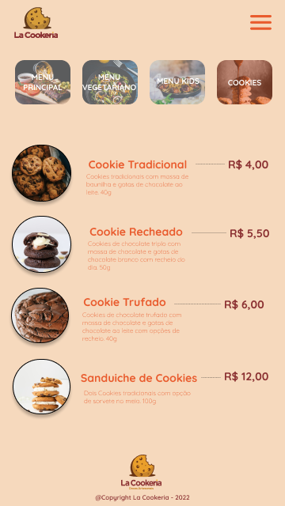

# LaCookeria
<!--   -->
O LaCookeria é um site que lista o cardapio e pratos do menu.
Aceita pedidos e

## 🔨 Funcionalidades do projeto

## ✔️ Técnicas e tecnologias utilizadas

- `React`
- `React Hooks`
- `TypeScript`
- `axios`

## 🛠️ Abrir e rodar o projeto

Para abrir e rodar o projeto, execute npm i para instalar as dependências e npm start para inicar o projeto.

Depois, acesse <a href="http://localhost:3000/">http://localhost:3000/</a> no seu navegador.

## 📚 Mais informações do curso

